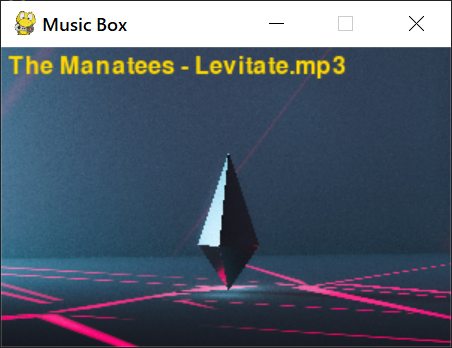

<h1 align="center">Проекты</h1>

 

  

  
  
  
  
  
  

_Регулярно пополняемая репа проектами на Python_

---

 <h1>Music Box</h1>  
 

   
 

 <h3>Функционал</h3>
 
 | Клавиши     | Описание            |
 | ----------- | --------------------|
 | `SPACE`     | Следующая песня     |
 | `ARROW_UP`  | Увеличить громкость |
 | `ARROW_DOWN`| Уменьшить громкость |
 

 

