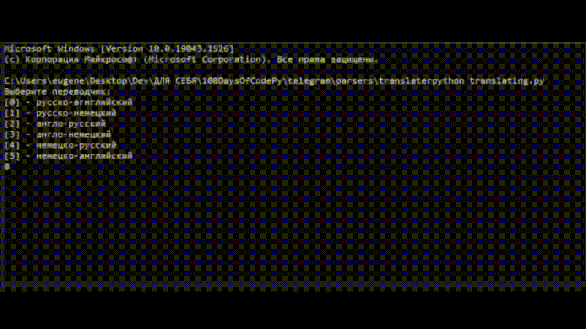
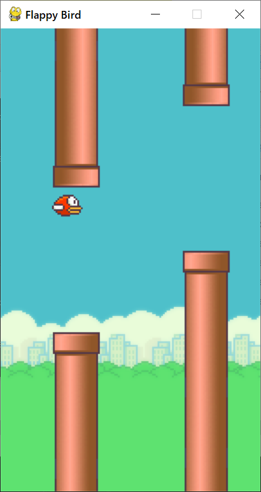
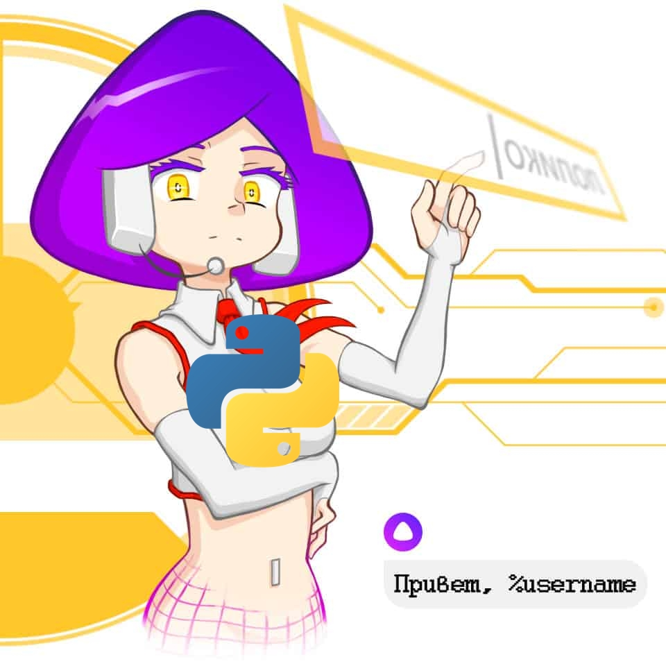
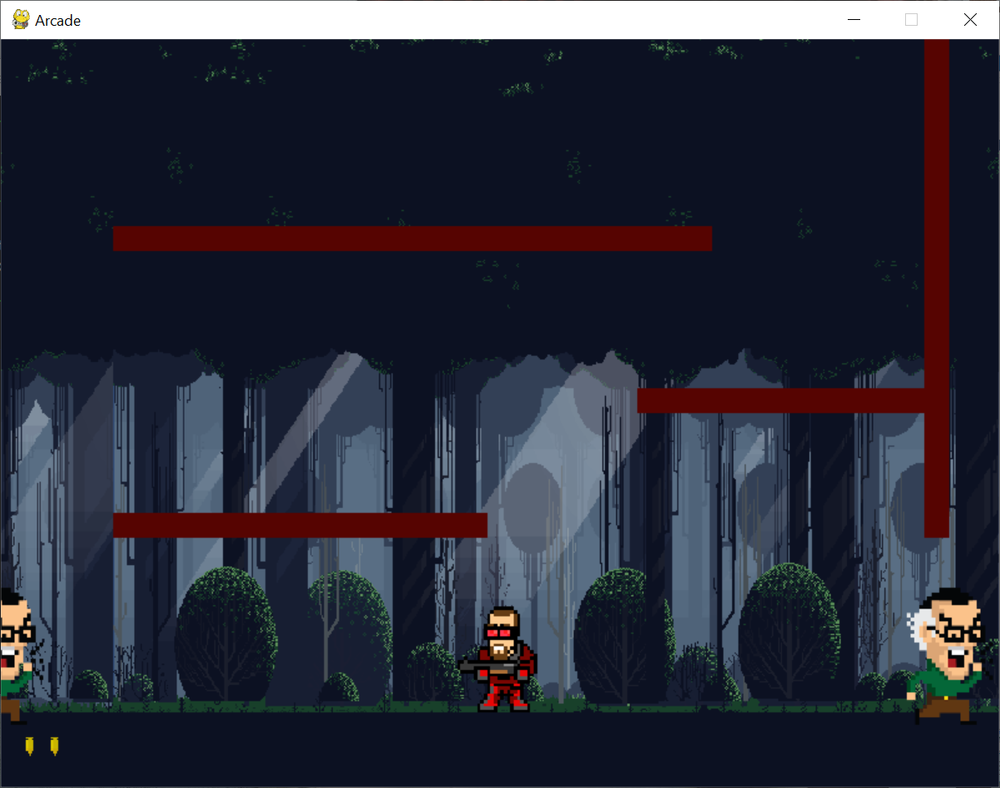
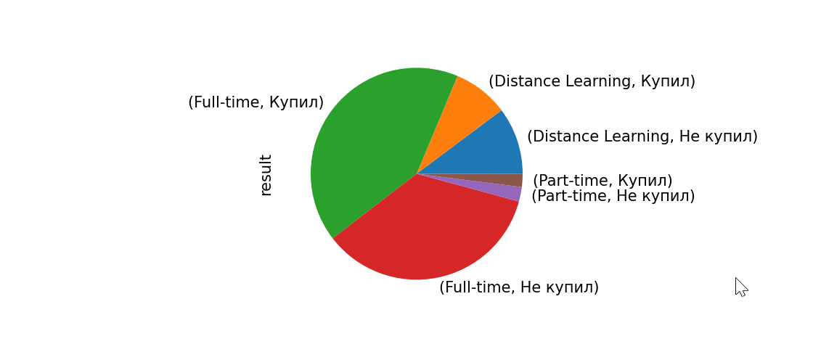
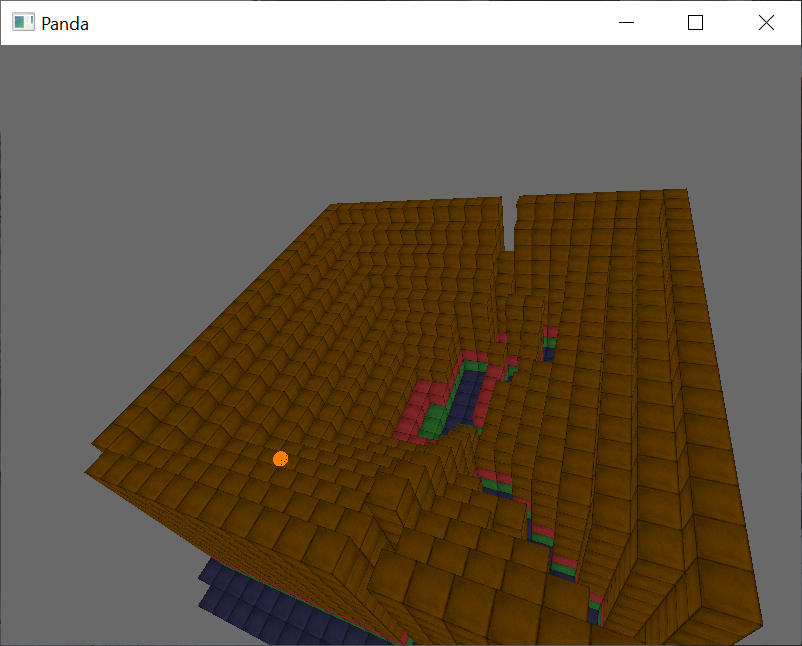
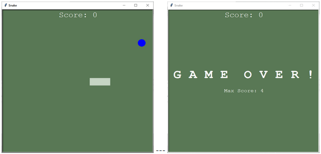
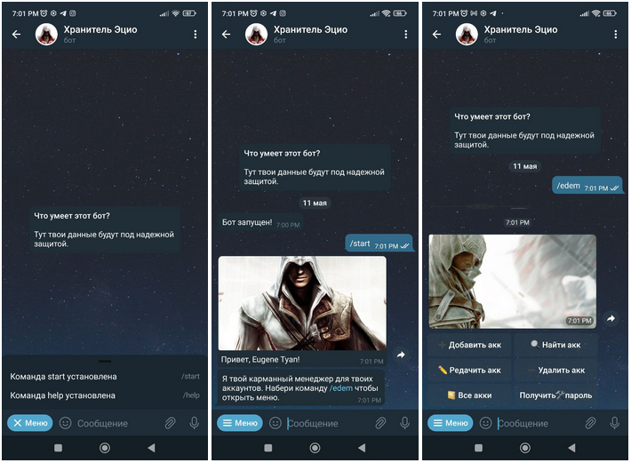

<h1 align="center">Проекты</h1>

 

  

  
  
  
  
  
  

_Регулярно пополняемая репа проектами на Python_ 
В разделе <a href="https://github.com/jonotyan/python/tree/main/2D%20games/pygame/simple%20elements">simple elements</a> лежат отдельные функции pygame.

---

 <h1>Music Box</h1>  
 

   <b>Краткое описание:</b> 
   Элементарное воспроизведение .mp3 и .ogg файлов через <b>pygame</b>.   
   
    <a href="https://github.com/jonotyan/python/tree/main/2D%20games/pygame/musicBox">Проект</a>
 

 <h3>Функционал</h3>
 
 | Клавиши     | Описание            |
 | ----------- | --------------------|
 | `SPACE`     | Следующая песня     |
 | `ARROW_UP`  | Увеличить громкость |
 | `ARROW_DOWN`| Уменьшить громкость |
 

 <h1>Простой переводчик</h1>  
 

   <b>Краткое описание:</b> 
   Один из самых быстрых и простых модулей для перевода. Модуль работает с Microsoft Translation API, MyMemory API, LibreTranslate и API DeepL. Просто выбираешь с какого на кокой язык перевести и вводишь текст для перевода.  
   
    <a href="https://github.com/jonotyan/python/blob/main/cmd/translater/translating.py">Проект</a>
 

 <h1>Flappy Bird</h1>  
 

   <b>Краткое описание:</b> 
   Аналог мобильной игры Flappy Bird на pygame  
   
    <a href="https://github.com/jonotyan/python/tree/main/2D%20games/pygame/FlappyBird">Проект</a>
 

 <h1>Like Alice</h1>  
 

   <b>Краткое описание:</b> 
   Голосовой помощник на python. Слушает микрофон, распознает речь: pyttsx3 и speech_recognition  
   
    <a href="https://github.com/jonotyan/python/blob/main/desktopApps/Alice/app.py">Проект</a>
 

 <h1>Arcade game</h1>  
 

   <b>Краткое описание:</b> 
   Уровень 2D-аркады. Pygame  
   
    <a href="https://github.com/jonotyan/python-sandbox/tree/main/2D%20games/pygame/Arcade">Проект</a>
 

 <h1>Data Science & Machine learning</h1>  
 

   <b>Краткое описание:</b> 
   Выявление вероятности покупок на сайте c вероятностью > 80%.  
   
    <a href="https://github.com/jonotyan/python-sandbox/tree/main/ML">Проект</a>
 

 <h1>Песочница на основе Panda3D</h1>  
 

   <b>Краткое описание:</b> 
   Простая песочница с открытым миром. Основной функционал майнкрафта.  
   
    <a href="https://github.com/jonotyan/python-sandbox/tree/main/panda3D">Проект</a>
 

 <h1>Простая 2D-змейка</h1>  
 

   <b>Краткое описание:</b> 
   Змейка написана с использованием модуля Turtle.  
   
    <a href="https://github.com/jonotyan/Simple-Snake">Проект</a>
 

 <h1>Telegram-бот "Хранитель паролей"</h1>  
 

   <b>Краткое описание:</b> 
   Бот имеет бд с возможностями поиска, записи и удаления аккаунтов, может выгружать данные в csv-файл. По типу записной книжки. Также умеет генерировать случайные пароли.  
   
    <a href="https://github.com/jonotyan/telegram-password-manager">Проект</a>
 

 <h1>Тест Руфье</h1>  
 

   <b>Краткое описание:</b> 
   Проба Руфье — Диксона представляет собой нагрузочный комплекс, предназначенный для оценки работоспособности сердца при физической нагрузке.  Существуют прямые и косвенные, простые и сложные методы определения PWC. К числу простых и косвенных методов определения PWC относят функциональную пробу Руфье и её модификацию — пробу Руфье — Диксона, в которых используются значения частоты сердечных сокращений в различные по времени периоды восстановления после относительно небольших нагрузок.  
   
    <a href="https://github.com/jonotyan/kivy-app-Ruffier">Проект</a>
 

